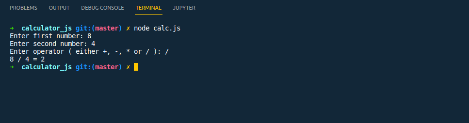

# Build a basic arithmetic calculator without a frontend

- The calculator should be able to perform basic operations like Addition, Subtraction, Multiplication, & Division

## How to run this program

- git clone `https://github.com/ginabeki/calculator_js.git` on the terminal for https,
  git clone `git@github.com:ginabeki/calculator_js.git` on the terminal for ssh.
- Make sure you have Node and NPM installed
- Run `npm install prompt-sync` in the terminal
- Now run the program on the CLI

## Output:

 

 
 

